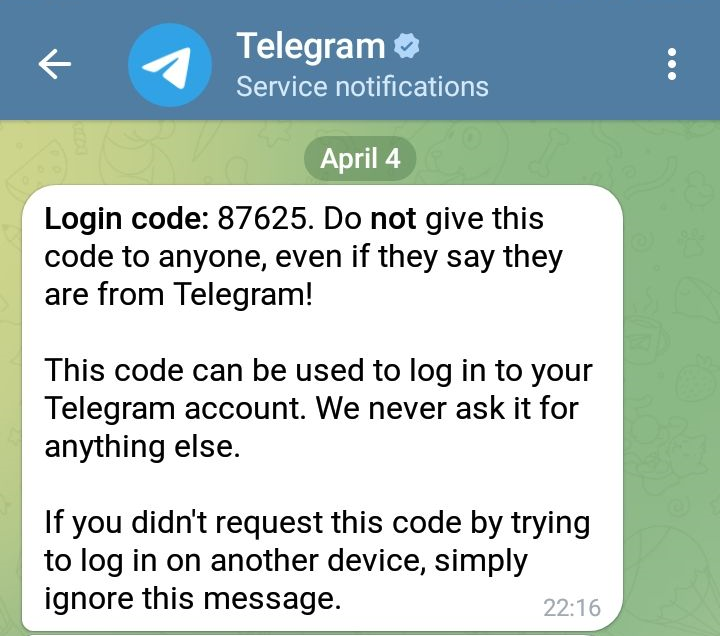

# Simple Telegram Console Client

With use of [TD Light Java](https://github.com/tdlight-team/tdlight-java)

## Requirements

TD Light Java requires JRE 17 (Java version 17) to run

## Get Started

On the first run it asks you for a phone number to receive a verification code:

1. Type `phone`
2. Type your phone number (e.g. `+13010000000`)
3. Check your Mobile or Desktop client where you are logged in with this number. You will get a message with some verification code from Telegram account
4. Type that verification code (e.g. 87625)

```text
[login] Do you want to login using a bot [token], a [phone] number, or a [qr] code? [token/phone/qr]:

phone

[login] Please type your phone number: +13010000000

[+13010000000] Enter authentication code
Phone number: 13010000000
Timeout: 0 seconds
Code type: TelegramMessage: 87625
```



From now on if you have been successfully logged in client will print out its name (first name of account):

```text
Hello, my name is: Kotlin
```

## Configuration files

After first run your authentication credentials will be saved in file-based database in directory located at:

`console_client/src/main/resources/tdlib/db/`

So you don't need receive and type a verification code on the next time

## Logging configuration

### Pattern explanation

:soon: _TODO_

### Replacements have made

Sometimes inner TD Lib logger sends a log message with trailing `\n` character

:soon: _TODO_

### TODO

Handle `kotlin.io.ReadAfterEOFException: EOF has already been reached` exception
